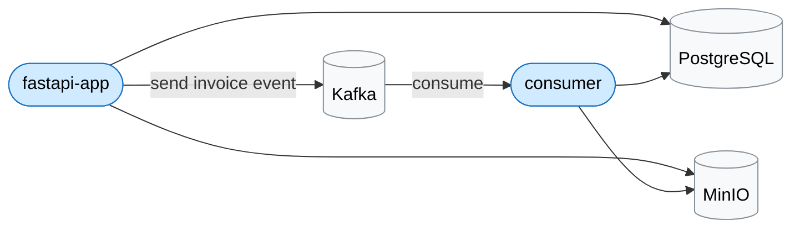

# fastapi-kafka-demo

Simple project to try out FastAPI and Kafka.

A Python consumer handles an invoice which is stored as a PDF to minio with metadata in PostgreSQL. FastAPI exposes the stored invoices.

## 🧩 Architecture
- `fastapi-app` – REST API and Kafka producer  
- `consumer` – Kafka consumer that processes events  
- `infra` – Docker setup for Kafka, PostgreSQL, and MinIO



## 🚀 Run locally

Start infra (Kafka, PostgreSQL, etc.)
```bash
cd infra
docker compose up -d
```

### fastapi-app

```bash
cd fastapi-app
python3 -m venv .venv
source .venv/bin/activate
pip install -r requirements.txt
alembic upgrade head
uvicorn app.main:app --reload
```

### consumer

```bash
cd consumer
python3 -m venv .venv
source .venv/bin/activate
pip install -r requirements.txt
python consumer.py
```

## 🧪 Try it out

This will submit 10 events to the queue.

```bash
for i in {1..10}; do
    curl -X 'POST' \
    'http://localhost:8000/invoices' \
    -H 'accept: application/json' \
    -H 'Content-Type: application/json' \
    -d "{
    \"order_id\": \"$(date +%s)-$i\",
    \"customer_id\": \"36b22c5c-c6ac-44f7-8b6e-5a5a956fae7b\",
    \"rows\": [
        {
        \"id\": \"bbd50bde-1955-442b-a86d-096bb57458f8\",
        \"name\": \"Potato, Yukon Gold\",
        \"quantity\": 143,
        \"unit_price\": 0.17
        },
        {
        \"id\": \"56c2aa1f-ebc2-4fed-b2ee-576a6bc55aee\",
        \"name\": \"Carrot, Imperator\",
        \"quantity\": 203,
        \"unit_price\": 0.21
        }
    ]
    }"
done
```

## 📘 API docs

http://localhost:8000/docs

## 🧠 Goal

I've worked with queues such as RabbitMQ and AWS SQS, but Kafka always felt mysterious. This project was my attempt to finally understand what Kafka does.